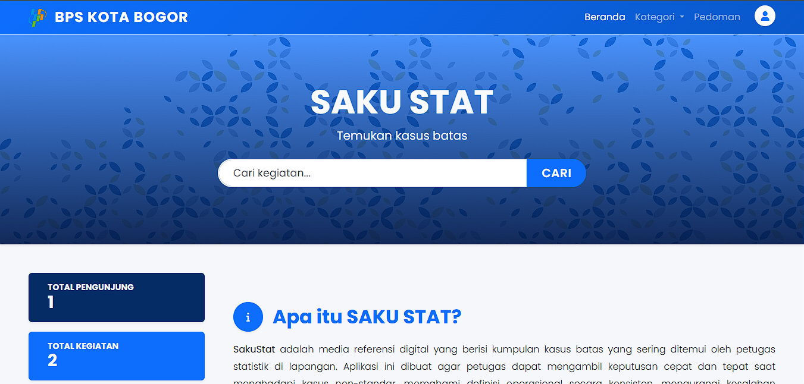
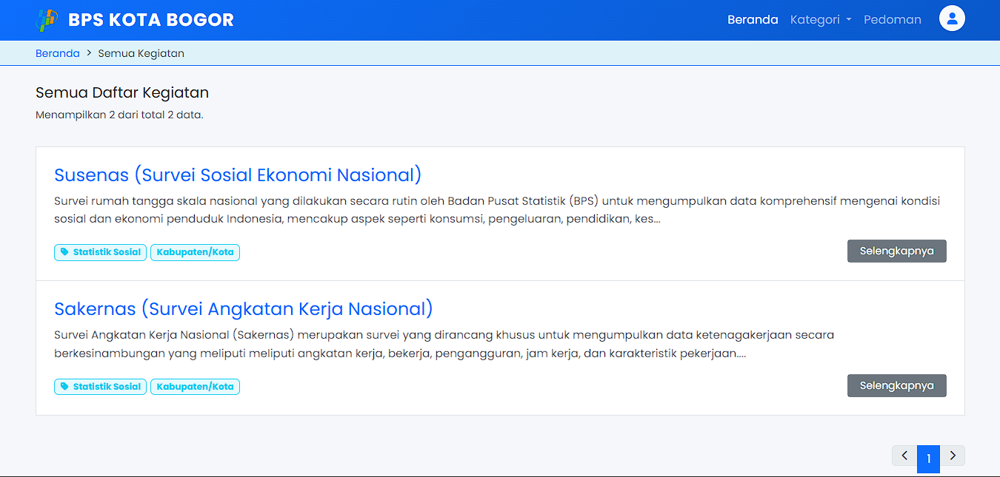

# 📘 SakuStat - Referensi Digital Kasus Batas Statistik

**SakuStat** adalah aplikasi berbasis web yang dikembangkan untuk **Badan Pusat Statistik (BPS) Kota Bogor**. Aplikasi ini berfungsi sebagai "saku digital" atau media referensi bagi petugas statistik lapangan untuk menemukan solusi atas **kasus batas (boundary cases)** yang sering ditemui saat melakukan pendataan/survei.

Tujuan utama aplikasi ini adalah menjaga konsistensi konsep definisi, mengurangi kesalahan pencatatan, dan mempercepat pengambilan keputusan petugas di lapangan.

---

## 🌟 Fitur Utama

### 📱 Halaman Publik (Petugas Lapangan)

- **Pencarian:** Mencari kegiatan atau kasus batas berdasarkan kata kunci spesifik.
- **Navigasi Kategori:** Menelusuri kasus batas berdasarkan kategori survei (Sosial, Produksi, Distribusi, dll).
- **Detail Kegiatan & Solusi:** Menampilkan pertanyaan (situasi lapangan) dan jawaban (solusi) secara terstruktur.
- **Unduh Pedoman:** Akses langsung ke file PDF pedoman survei terkait.
- **Responsive Design:** Tampilan ramah pengguna diakses melalui Smartphone, Tablet, maupun Desktop.

### 🔐 Halaman Admin (Back-Office)

- **Dashboard Statistik:** Ringkasan jumlah pengunjung, total survei, dan total kasus batas.
- **Manajemen Kegiatan (CRUD):** Tambah, Edit, Hapus data kegiatan statistik.
- **Manajemen Kasus Batas (CRUD):** Mengelola tanya-jawab kasus batas yang terhubung dengan kegiatan.
- **Manajemen Kategori & Pedoman:** Pengaturan kategori survei dan upload link pedoman.

---

## 🛠️ Teknologi yang Digunakan

- **Bahasa Pemrograman:** PHP (Native)
- **Database:** MySQL
- **Frontend Framework:** Bootstrap 5.3
- **Styling:** CSS3 Custom & FontAwesome 6
- **Server Environment:** XAMPP (Apache)

---

## 📸 Tangkapan Layar (Screenshots)

_(Anda bisa mengganti link gambar di bawah ini dengan screenshot asli aplikasi Anda)_

|              Halaman Utama              |              Halaman Pencarian              |
| :-------------------------------------: | :-----------------------------------------: |
|  |  |

|               Detail Kegiatan               |              Dashboard Admin              |
| :-----------------------------------------: | :---------------------------------------: |
|  |  |

---

## 👨‍💻 Pengembang

**[Muhammad Ramdani]**

- Mahasiswa Sistem Informasi
- Universitas Nusa Putra
- Internship di BPS Kota Bogor

---

**SakuStat © 2025 - BPS Kota Bogor**
